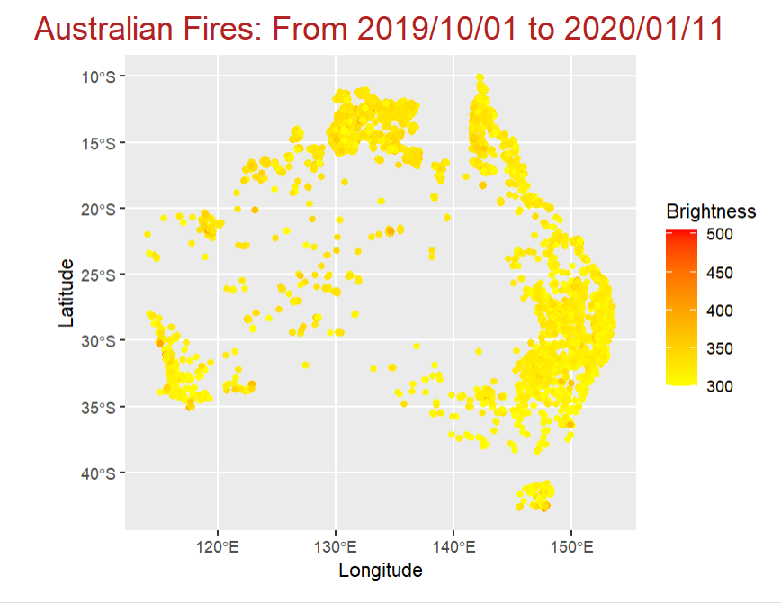

---
 github_document
---


AustraliaFirePredictor
<!-- badges: start -->
<!-- badges: end -->
The goal of AustraliaFirePredictor is to provide tools for predicting fire locations and analyzing fire data in Australia using machine learning models, specifically XGBoost.

Installation
You can install the development version of AustraliaFirePredictor from GitHub with:

```{r}
# install.packages("devtools")
devtools::install_github("ishancoderr/AustraliaFirePredictor")

```
## Data Explanation

The data used in this package contains the following columns:

- **Latitude**: Center of 1km fire pixel but not necessarily the actual location of the fire as one or more fires can be detected within the 1km pixel.
- **Longitude**: Center of 1km fire pixel but not necessarily the actual location of the fire as one or more fires can be detected within the 1km pixel.
- **Brightness**: Brightness temperature 21 (Kelvin). Channel 21/22 brightness temperature of the fire pixel measured in Kelvin.
- **Scan**: Along Scan pixel size. The algorithm produces 1km fire pixels, but MODIS pixels get bigger toward the edge of scan. Scan and track reflect actual pixel size.
- **Track**: Along Track pixel size. The algorithm produces 1km fire pixels, but MODIS pixels get bigger toward the edge of scan. Scan and track reflect actual pixel size.
- **Acq_date**: Acquisition Date. Date of MODIS acquisition.
- **Acq_time**: Acquisition Time. Time of acquisition/overpass of the satellite (in UTC).
- **Satellite**: Satellite. A = Aqua and T = Terra.
- **Instrument**: Instrument. Constant value for MODIS.
- **Confidence**: Confidence (0-100%). This value is based on a collection of intermediate algorithm quantities used in the detection process. It is intended to help users gauge the quality of individual hotspot/fire pixels. Confidence estimates range between 0 and 100% and are assigned to one of the three fire classes (low-confidence fire, nominal-confidence fire, or high-confidence fire).
- **Bright_t31**: Brightness temperature 31 (Kelvin). Channel 31 brightness temperature of the fire pixel measured in Kelvin.
- **Frp**: Fire Radiative Power. Depicts the pixel-integrated fire radiative power in MW (megawatts).
- **Daynight**: Day / Night. D = Daytime, N = Nighttime.

This data is used to train machine learning models to predict fire occurrences and analyze fire patterns in Australia.

Example
This is a basic example that shows you how to use the main functions in the AustraliaFirePredictor package:

**predict_fire(input_data)**- function 

The predict_fire(input_data) function preprocesses the input data and utilizes a pre-trained XGBoost model to make fire predictions. It converts categorical variables to numeric format, loads the model from the package, and generates predictions based on the provided data.

```{r}
# Example usage
input_data <- data.frame(
  longitude = -119.7,
  latitude = 34.5,
  brightness = 300.0,
  frp = 12.5,
  satellite = "Aqua",
  instrument = "MODIS",
  daynight = "D",
  scan = 1.1,
  track = 1.2,
  bright_t31 = 290.0
)

# Call the function with the input data
predictions <- predict_fire(input_data)

# Print predictions
print(predictions)

```

**plot_fire_locations()**

The plot_fire_locations() function generates a plot of fire locations using data from a built-in dataset.

```{r}
library(AustraliaFirePredictor)

# Plot fire locations
plot_fire_locations()
```




**fire_location_check(file_path, output_model_path)**

The fire_location_check(file_path, output_model_path) function reads fire data from a CSV file, preprocesses it, trains an XGBoost model, and optionally saves the model to the specified path.
**if you have dataset with above parameters you can tran model via this function**

```{r}
library(AustraliaFirePredictor)

# Specify file paths
file_path <- system.file("extdata", "fire_data.csv", package = "AustraliaFirePredictor")
output_model_path <- system.file("model", "firePredictorModel.xgb", package = "AustraliaFirePredictor")

# Call the function with the file paths
results <- fire_location_check(file_path, output_model_path)

# View the results
print(results)
```


